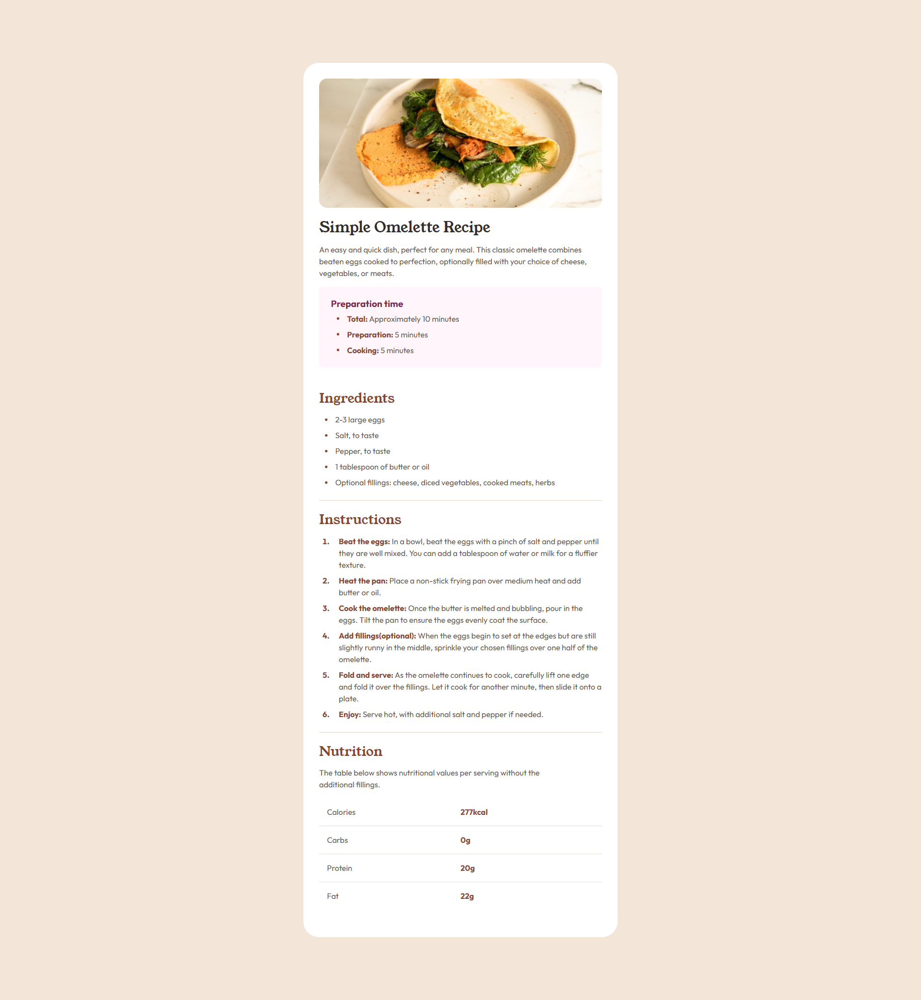

# Frontend Mentor - Recipe page solution

This is a solution to the [Recipe page challenge on Frontend Mentor](https://www.frontendmentor.io/challenges/recipe-page-KiTsR8QQKm). Frontend Mentor challenges help you improve your coding skills by building realistic projects.

## Table of contents

- [Overview](#overview)
  - [The challenge](#the-challenge)
  - [Screenshot](#screenshot)
  - [Links](#links)
- [My process](#my-process)
  - [Built with](#built-with)
- [Author](#author)
- [Acknowledgments](#acknowledgments)

## Overview

### Screenshot

### Links

- Solution URL: [Frontend Mentor](https://www.frontendmentor.io/solutions/recipe-page-responsive-design-_GXOQgKTjB)
- Live Site URL: [Recipe Page](https://ariarzg.github.io/recipe-page-main/)

## My process

### Built with

- Semantic HTML5 markup
- CSS custom properties
- Flexbox
- Mobile-first workflow
- Accessibility

## Author

- Frontend Mentor - [@Ariarzg](https://www.frontendmentor.io/profile/Ariarzg)
- Github - [Ariarzg](https://www.github.com/Ariarzg)

## Acknowledgments

This [Man](https://www.frontendmentor.io/profile/Islandstone89) helps so much in refactoring my code. What a great man to have in the community
